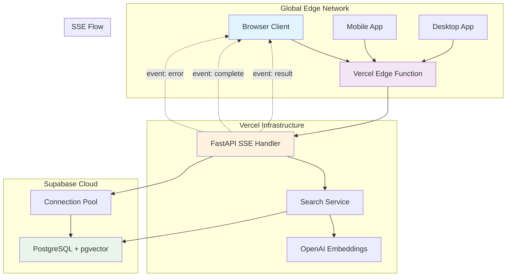
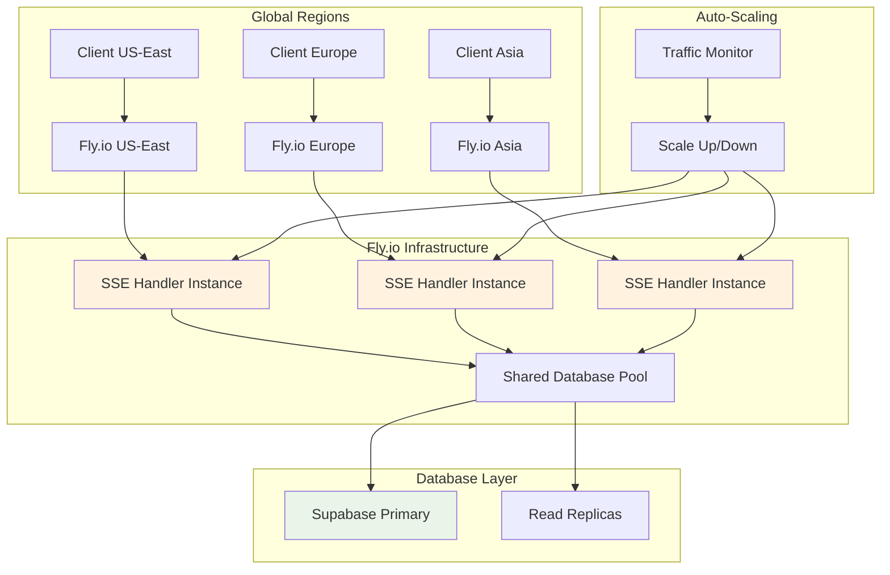
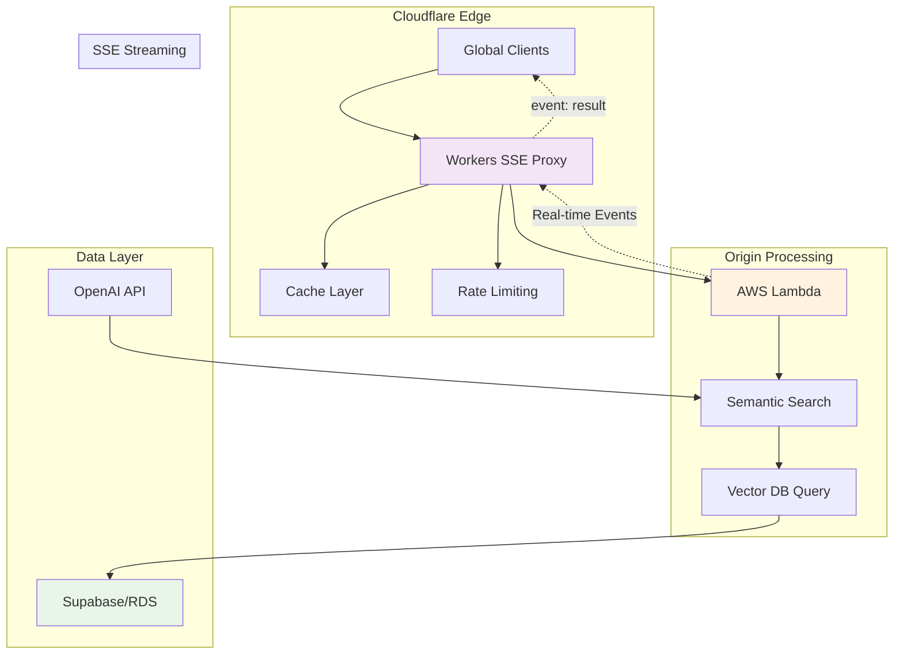
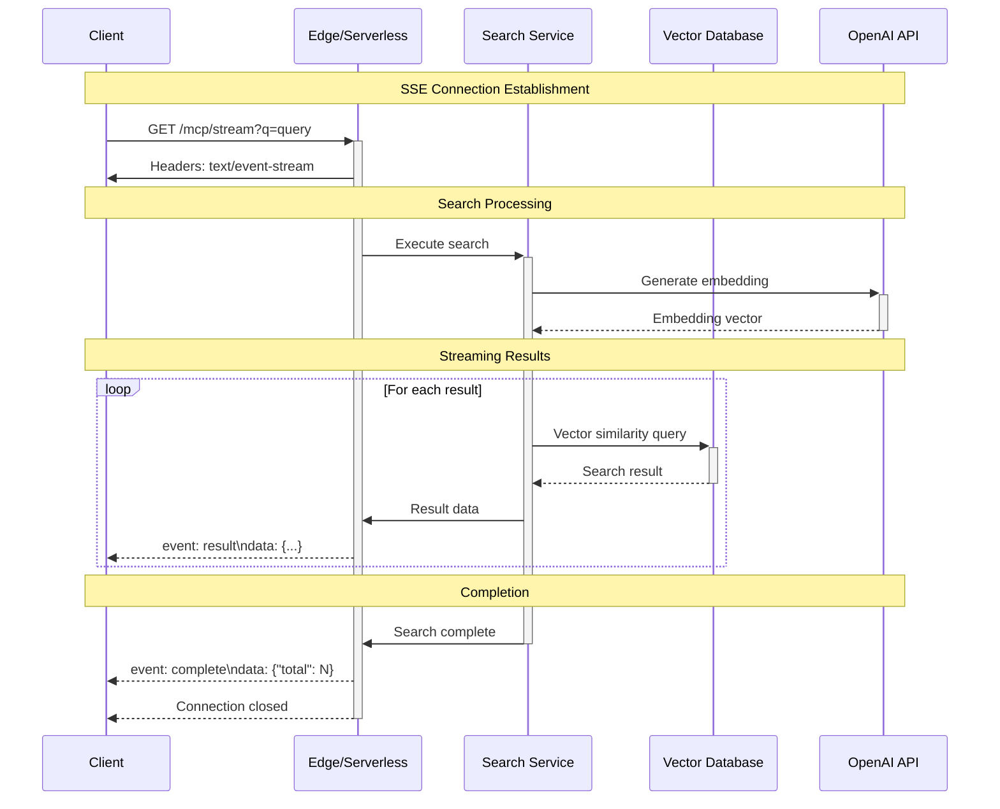
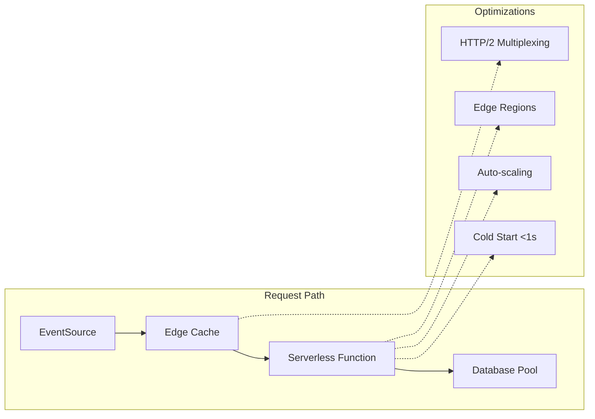
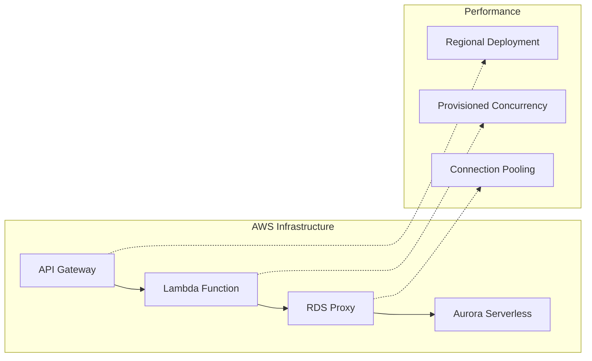
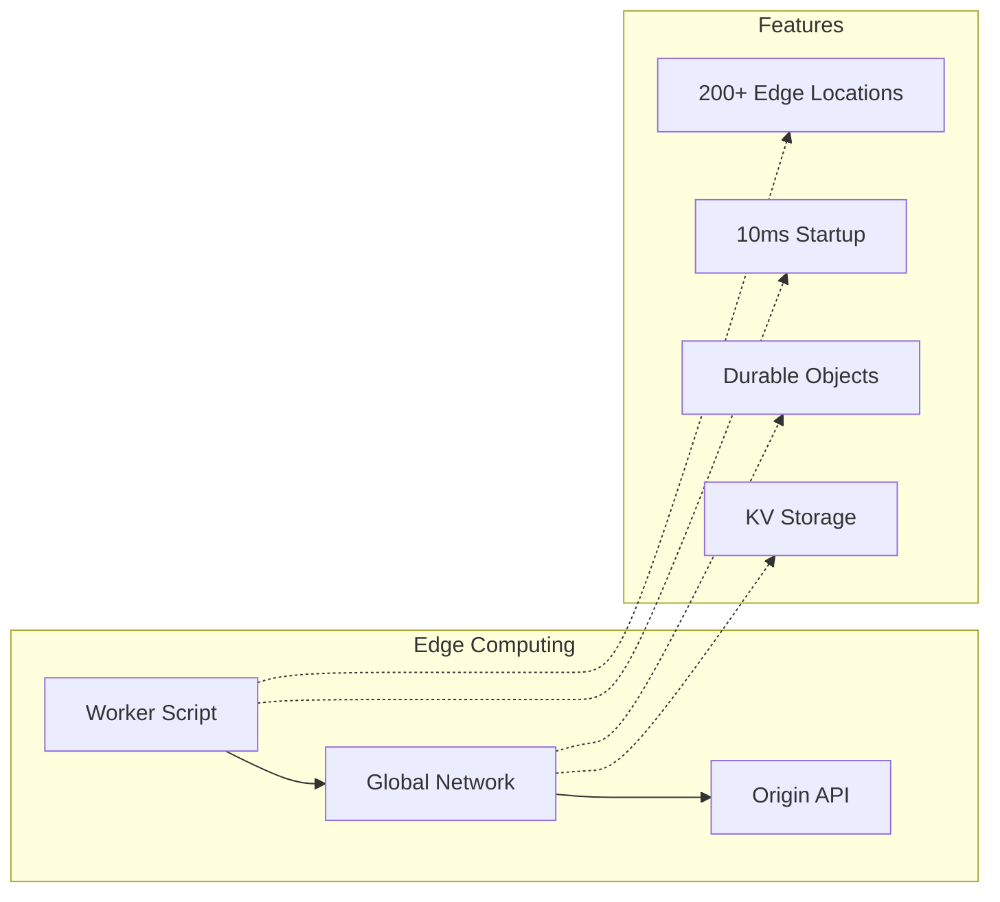
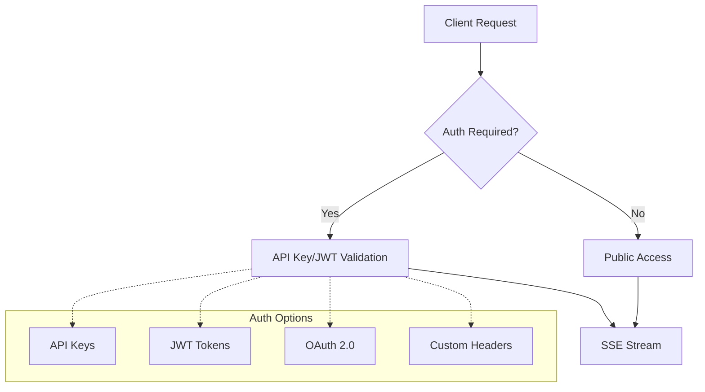
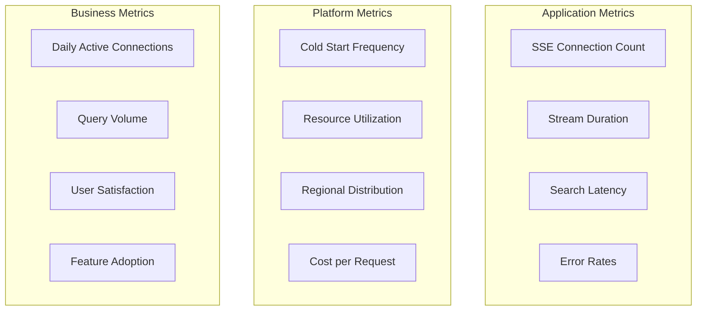

# SSE MCP Server Architecture

This document describes the architecture patterns for deploying the HTTP-based MCP Server with Server-Sent Events (SSE) across different cloud platforms.

## Architecture Overview

The SSE MCP Server is designed as a **stateless, horizontally-scalable** alternative to traditional TCP-based MCP servers, optimized for serverless and edge deployments.

### Core Architecture Principles

1. **Stateless Design** – No persistent connections or server-side state
2. **HTTP-Native** – Uses standard HTTP/HTTPS for all communication
3. **Event-Driven Streaming** – Real-time results via Server-Sent Events
4. **Auto-Scaling** – Leverages platform auto-scaling capabilities
5. **Edge-Optimized** – Works seamlessly with global CDNs

---

## Deployment Patterns

### 1. Serverless Edge Pattern (Vercel + Supabase)

**Best for:** Global web applications with auto-scaling requirements



**Characteristics:**
- ⚡ Sub-100ms global latency via edge locations
- 🔄 Automatic scaling (0 → ∞ concurrent connections)
- 💰 Pay-per-request pricing model
- 🌍 Global distribution included
- ⏱️ Cold start: <1s

---

### 2. Container Orchestration Pattern (Fly.io)

**Best for:** Persistent deployments with predictable traffic patterns



**Characteristics:**
- 🎯 Predictable performance and costs
- 🌐 Multi-region deployment
- 💾 Persistent storage and caching
- 📊 Traditional server monitoring
- ⏱️ Cold start: 0s (persistent)

---

### 3. Hybrid Edge/Origin Pattern (Cloudflare Workers + Lambda)

**Best for:** High-performance applications with complex processing requirements



**Characteristics:**
- ⚡ Ultra-low latency via global edge
- 🛡️ Built-in DDoS protection and rate limiting
- 🔄 Smart caching at edge locations
- 💪 Heavy processing at origin
- ⏱️ Cold start: <10ms (edge) + <1s (origin)

---

## SSE Streaming Flow

### Message Flow Architecture



### Connection Lifecycle

1. **Connection Establishment**
   - Client opens SSE connection with `EventSource`
   - Server validates parameters and sets streaming headers
   - Platform handles auto-scaling and load balancing

2. **Real-time Streaming**
   - Search service streams results as they're found
   - Each result emitted as separate SSE event
   - Platform handles back-pressure and client disconnects

3. **Graceful Completion**
   - Completion event with total count
   - Connection closed by server
   - Client can immediately reconnect for new searches

---

## Platform-Specific Optimizations

### Vercel Optimizations



**Key features:**
- Edge caching for static responses
- HTTP/2 multiplexing support
- Automatic HTTPS and CDN
- Zero-config deployments

### AWS Lambda Optimizations



**Key features:**
- Provisioned concurrency for consistent performance
- RDS Proxy for connection pooling
- Integration with AWS ecosystem
- Fine-grained cost control

### Cloudflare Workers Optimizations



**Key features:**
- Instant cold starts
- Global edge deployment
- TransformStream for SSE
- Integrated caching and storage

---

## Performance Characteristics

### Latency Comparison

| Platform | Cold Start | Warm Request | Global Reach | Concurrent Streams |
|----------|------------|--------------|--------------|-------------------|
| **Vercel** | <1s | <50ms | ✅ Edge | Unlimited |
| **AWS Lambda** | <500ms | <10ms | ⚠️ Regional | 1000/region |
| **Cloudflare Workers** | <10ms | <5ms | ✅ Global | Unlimited |
| **Fly.io** | 0s | <20ms | ✅ Multi-region | 250/instance |

### Scaling Patterns

**Horizontal Scaling (Serverless):**
```
Concurrent Connections: 1 → 10 → 100 → 1000+ (automatic)
Cost: Linear with usage
Latency: Consistent
Management: Zero
```

**Vertical Scaling (Containers):**
```
Instance Size: Small → Medium → Large (manual/auto)
Cost: Fixed baseline + scaling
Latency: Predictable
Management: Traditional ops
```

---

## Security Considerations

### Transport Security
- **TLS/HTTPS:** Mandatory for all platforms
- **Headers:** Security headers automatically applied
- **CORS:** Configurable origin restrictions
- **Rate Limiting:** Platform-native or custom implementation

### Authentication Patterns



### Data Privacy
- **In-transit:** TLS 1.2+ encryption
- **At-rest:** Database-level encryption (Supabase/AWS)
- **Logs:** Configurable retention and redaction
- **Compliance:** GDPR/SOC2 via platform compliance

---

## Monitoring & Observability

### Key Metrics



### Monitoring Stack

**Built-in Platform Monitoring:**
- Vercel Analytics & Logs
- AWS CloudWatch
- Cloudflare Analytics
- Fly.io Metrics

**Custom Application Metrics:**
- Prometheus endpoints (`/metrics`)
- OpenTelemetry tracing
- Structured logging
- Health check endpoints

---

This architecture enables the SSE MCP server to provide real-time, scalable search capabilities across diverse deployment environments while maintaining optimal performance and cost efficiency. 